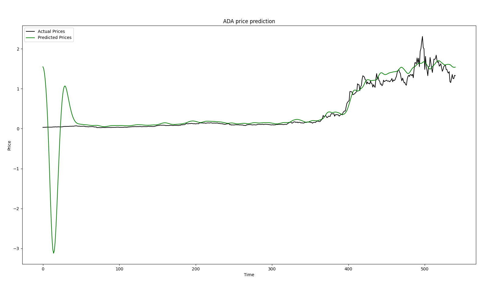

# Crypto-Currency-Predictor
This machine-learning algorithm takes in data from the last 60 days and tries to predict tomorrow's price of any crypto you ask it.

<h1> Predition 1 day into the future </h1>

<h1> Predition 30 days into the future </h1>

